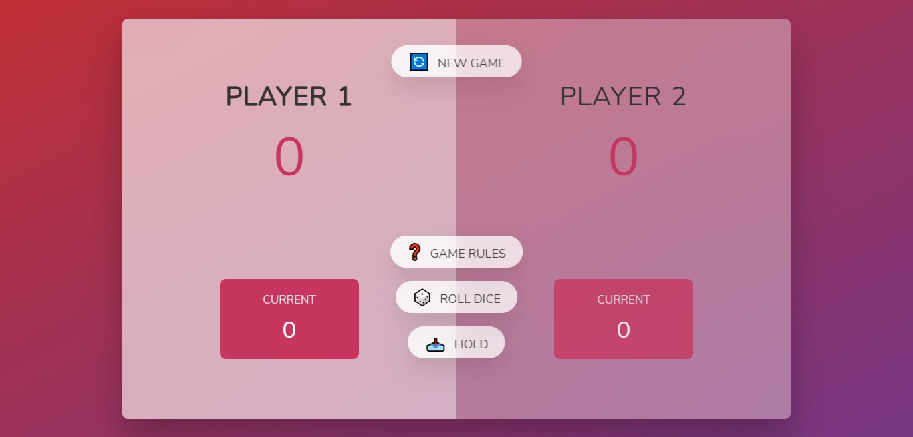
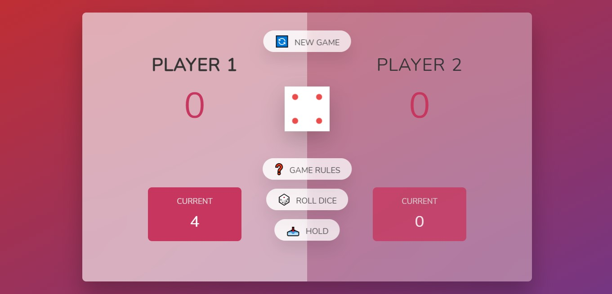
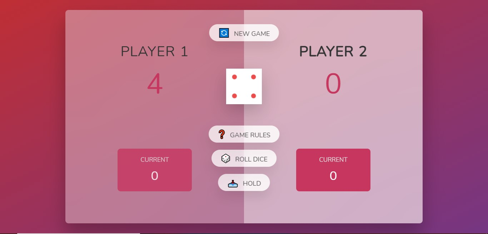
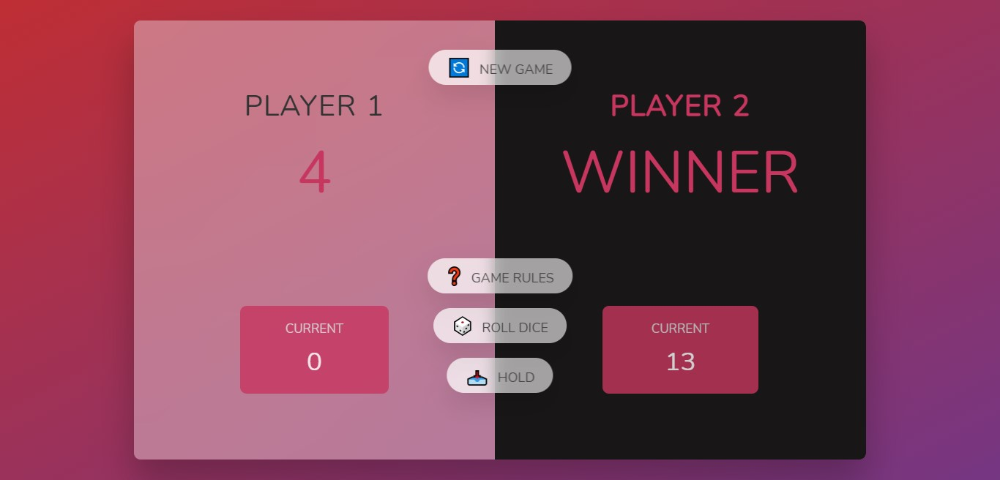

# Dice-Game
simple html,css,js game

**Player1 always has an advantage of rolling dice first.** 

**Each dice roll will add your score to current score.** 

**Hold button shifts all your current score to final score and changes turn.** 

**If dice roll gives 1.your current score become zero and turn changes.** 

**Player who reaches 50 first will win the game.** 

